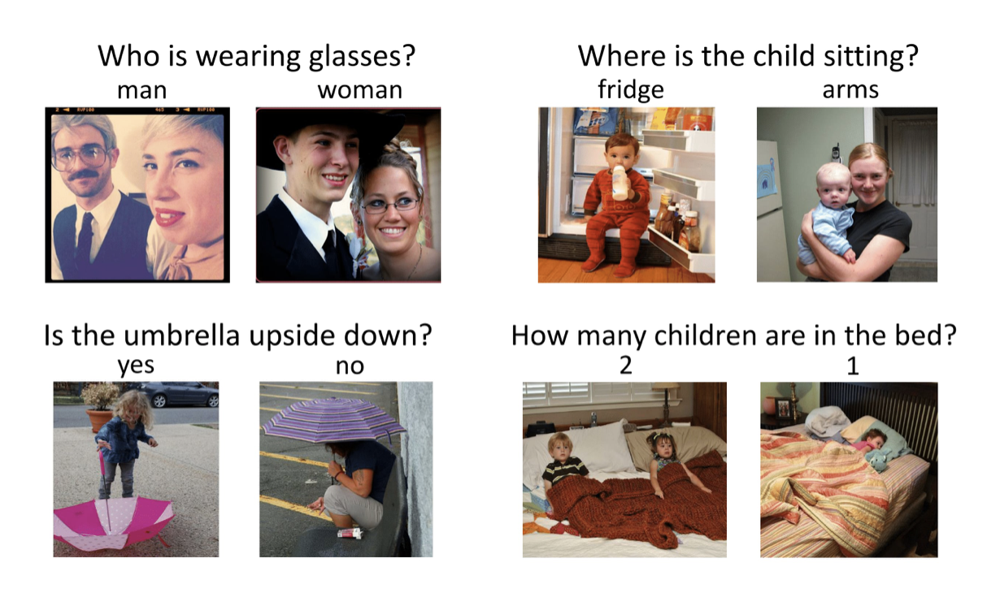
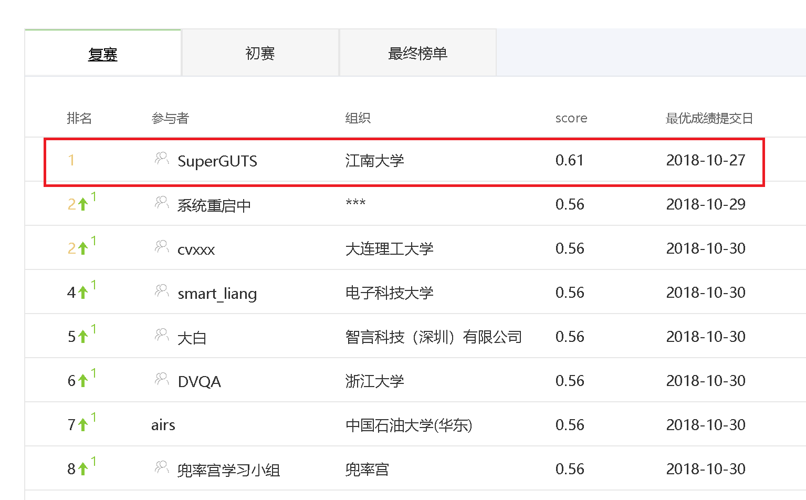
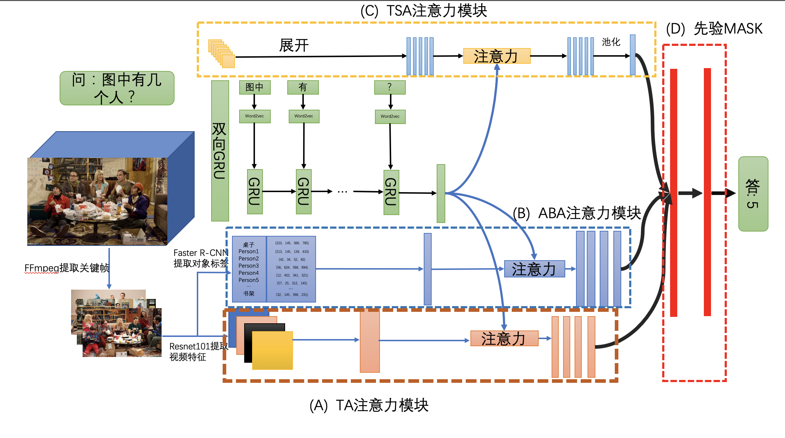
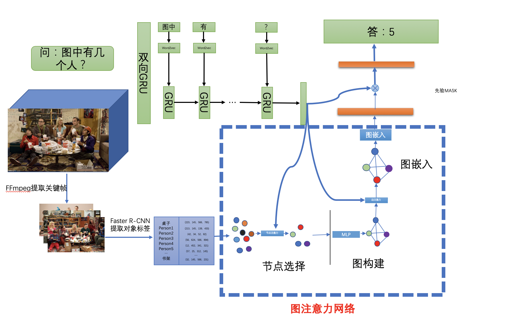

# 2020毕业设计repo-基于先验MASK的视频问答

## Background

- 做什么?
**对给定的短视频进行内容识别和分析，并回答每一个视频对应的问题。**



只不过这个工作是关于视频问答的:blush:

- 这个repo关于什么?
该Repo记录了我的毕业设计（基于先验MASK的视频问答），传统的算法要么耗时要么精度不高，我们采用了FFmpeg来抽取视频的关键帧，然后通过Faster R-CNN结合ResNet-101来抽取视频关键帧的信息（包括对象属性以及对象特征），接下来采用了三种注意力机制来全面提取视频与问题之间的特征，最后根据不同的问题进行**先验MASK**， 从而得到问题的答案。



- 算法原理






## Requirement

### 1.提取关键帧
```bash
ffprobe -select_streams v -show_frames -show_entries frame=pict_type -of csv
```

### 2.caffe环境（用来提取关键帧的特征）

* Ubuntu 16.04
* CUDA
* OpenBlas
* Boost 
* protobuf, glog, gflags, hdf5
* OpenCV >= 2.4 including 3.0
* lmdb, leveldb
* cuDNN
* Python2.7

使用的caffe为[bottom-up-attention](https://github.com/peteanderson80/bottom-up-attention)，**千万不要用官网的**

- 将CUDNN放出来，且用openBlas进行编译

- 如果遇到```fatal error: hdf5.h: No such file or directory compilation terminated.``` 请参考 [编译错误：fatal error: hdf5.h: No such file or directory compilation terminated.](https://blog.csdn.net/qq_38451119/article/details/81383266)

- 如果遇到```nvcc fatal : Unsupported gpu architecture 'compute_20'```请参考[nvcc fatal : Unsupported gpu architecture 'compute_20'](https://blog.csdn.net/fanhenghui/article/details/80092131)

- 如果遇到```undefined reference to cv::imread(cv::String const&, int)```
请将```Makefile.config```中的opencv注释取消掉

```
make -j8 && make pycaffe
```

**到此，Caffe环境安装完成。**

## Install

* Python3.6(训练用)
* tensorflow-gpu==1.12
* keras==2.0.4
* numpy

模型训练及推断环境
准备两张显存大于8G的卡(fold并行)  耗时约4-6小时
CUDA Version 9.0.176
cudnn 7.0.5

## Usage

去官网将数据下载到```data```目录下

### 特征抽取

```bash
cd code
sh -x feature_install.sh
sh -x get_feature.sh
```

### 模型训练
```bash
sh -x run.sh
```

### log

```bash
fold : 0
1
[0.0024209488725245856, 0.28805580325976804]
0.2876999238385377
2
[0.0016753669928048056, 0.38343505469112676]
0.3827113480578827
3
[0.0016148324926735375, 0.4010462158902791]
0.40327494287890325
4
[0.0015081304899695368, 0.4563208453376707]
0.4565879664889566
5
......
......
......
......
```


## Releated efforts

todo

## Maintainer
@hadxu

## Thanks

@qrfaction

## Cites

[1] Antol S, Agrawal A, Lu J, et al. VQA: Visual Question Answering[C]// IEEE International Conference on Computer Vision. 2017.
[2] Yin Zhang, Rong Jin, Zhi-Hua Zhou. Understanding bag-of-words model: a statistical framework[J]. International Journal of Machine Learning & Cybernetics, 1(1-4):43-52.
[3] Bai Xue, Chen Fu, Zhan Shaobin. A Study on Sentiment Computing and Classification of Sina Weibo with Word2vec[C]// 2014 IEEE International Congress on Big Data (BigData Congress). IEEE, 2014.
[4] Devlin, Jacob, et al. "Bert: Pre-training of deep bidirectional transformers for language understanding." arXiv preprint arXiv:1810.04805 (2018).
[5] Yang, Zhilin, et al. "Xlnet: Generalized autoregressive pretraining for language understanding." Advances in neural information processing systems. 2019.
[6] Zhou, Bolei, et al. "Simple baseline for visual question answering." arXiv preprint arXiv:1512.02167 (2015).
[7] Simonyan, Karen, and Andrew Zisserman. "Very deep convolutional networks for large-scale image recognition." arXiv preprint arXiv:1409.1556 (2014).
[8] Hochreiter, Sepp, and Jürgen Schmidhuber. "Long short-term memory." Neural computation 9.8 (1997): 1735-1780.
[9] Lin, Tsung-Yi, et al. "Microsoft coco: Common objects in context." European conference on computer vision. Springer, Cham, 2014.
[10] Yu, Zhou, et al. "Beyond bilinear: Generalized multimodal factorized high-order pooling for visual question answering." IEEE transactions on neural networks and learning systems 29.12 (2018): 5947-5959.


